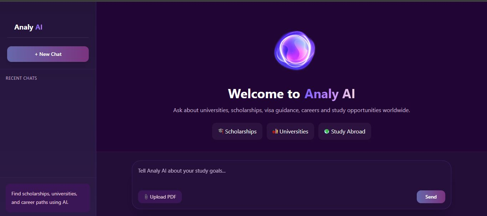
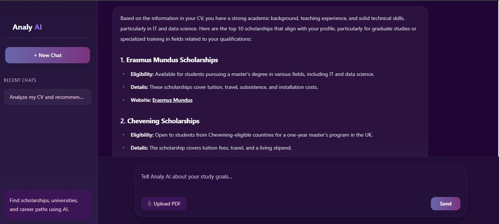
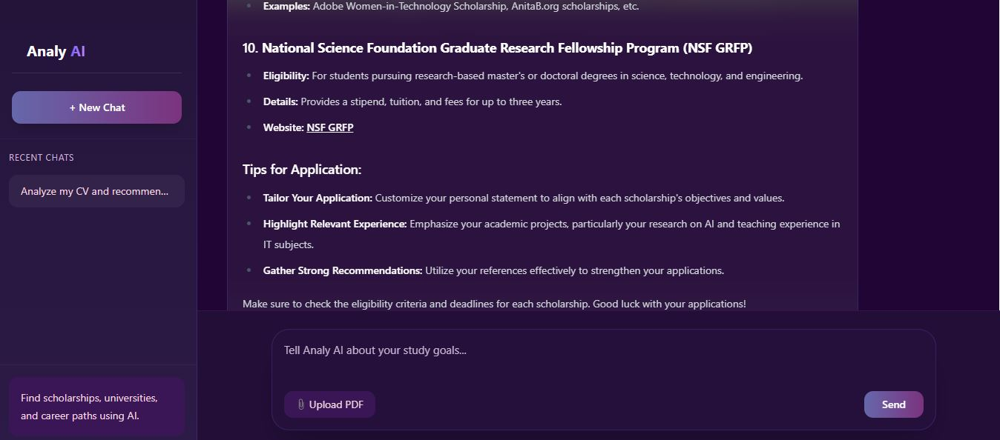
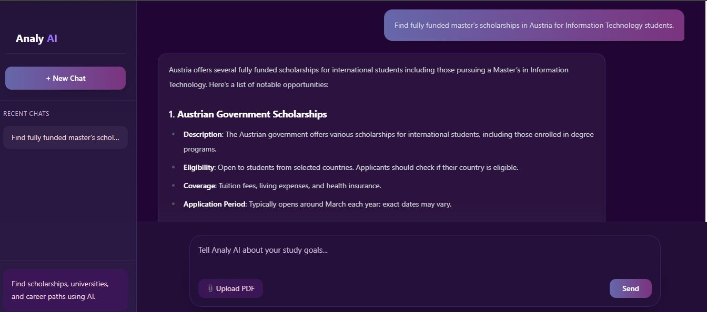
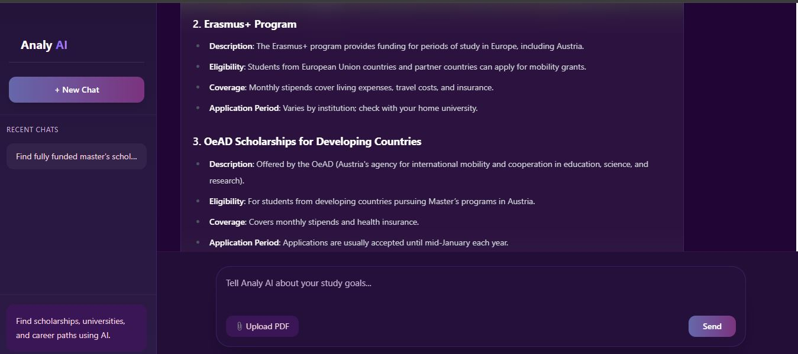
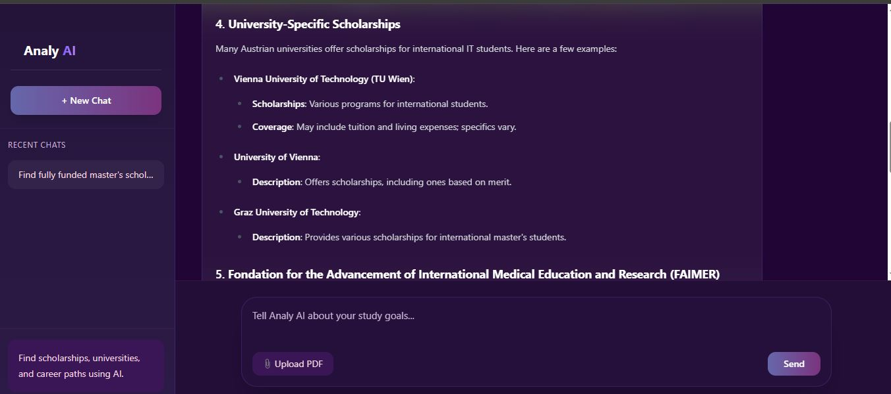
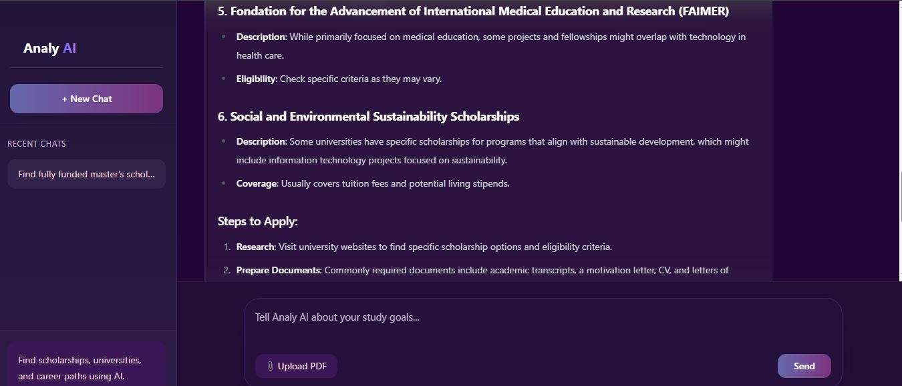

# 🎓 Analy AI

Analy AI is an AI-powered scholarship and study abroad assistant designed to help students discover scholarships, universities, and career opportunities based on their interests and academic goals.

## 🚀 Features

* AI-powered scholarship recommendations
* University suggestions by country and field of study
* Career guidance and study pathways
* Resume upload support
* Interactive chatbot interface
* Modern React-based UI
* FastAPI backend integration

## 🛠️ Tech Stack

### Frontend

* React.js
* Vite
* Tailwind CSS
* Axios

### Backend

* FastAPI
* Python
* OpenRouter API
* DeepSeek AI Model

## Screenshots

### Home Screen

### Chat Interface

### PDF Analysis

## 💡 Example Use Cases

* Find scholarships for Master's degrees abroad
* Discover universities based on academic interests
* Explore career pathways in IT and Engineering
* Get guidance on study-abroad opportunities

## 📂 Project Structure

Analy-AI

├── analy-ai-frontend/

├── Analy-AI-Backend/

└── README.md

## ⚙️ Installation

### Frontend

npm install

npm run dev

### Backend

pip install -r requirements.txt

uvicorn main:app --reload

## 🔒 Security

API keys are stored securely using environment variables and are not included in the repository.

## 👩‍💻 Author

Isuri Rajapaksha

Assistant Lecturer | Software Developer | AI Enthusiast

## 📫 Contact

LinkedIn: [www.linkedin.com/in/isuri-rajapaksha)

GitHub: github.com/isuri98-rajapaksha
